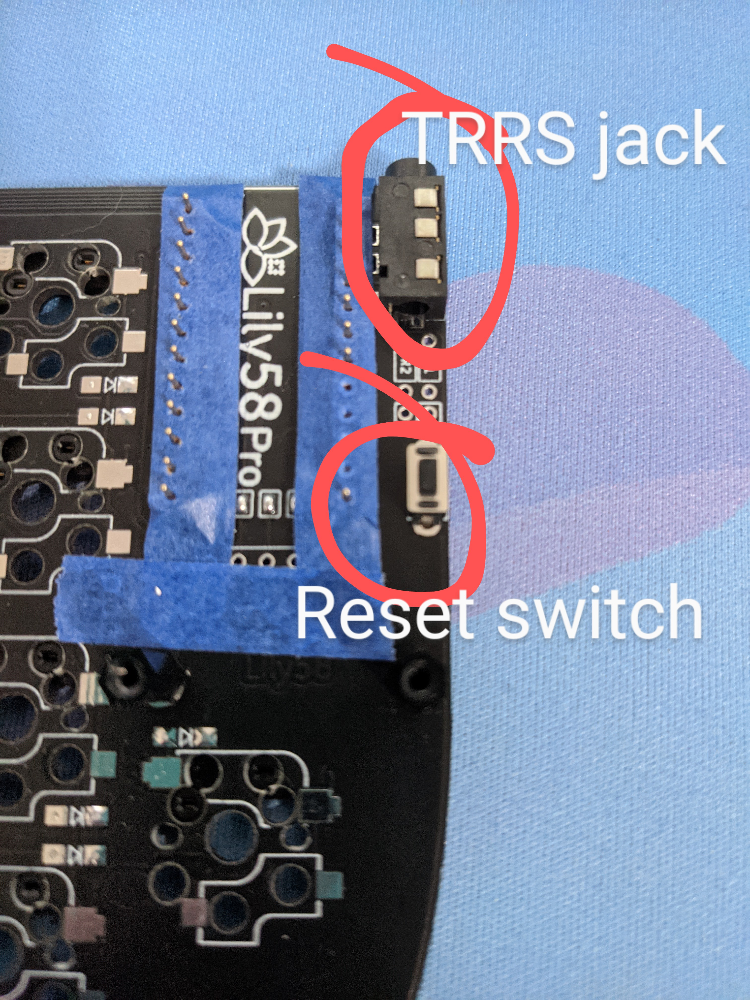
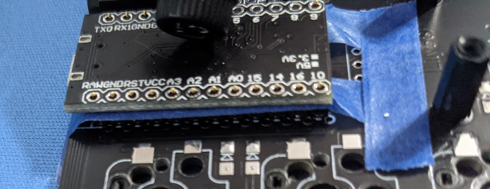

# Lily58 Pro Build Guide

Written: February 2021

Last Updated: February 2021

# Materials Needed

## Came with kit

I bought a kit secondhand through r/mechmarket that came with the items below.  Check the kit you buy to make sure it comes with everything you need. Order anything that isn't included separately.

* 2 Lily58 PCBs
* 2 TRRS jack
* 2 reset switches
* 58 SMD diodes
* 2 ProMicro controllers (or 2 Elite-C controllers)
* 2 plates
* 2 bottoms/cases
* 2 OLED screens + acrylic covers
* 58 hotswap sockets (Kailh or choc)
* TRRS cable
* standoffs (4 for acrylic covers, 10 for case)
* screws (8 for acrylic covers, 20 for case)

## Bought separately

I bought the pins from [Digikey](https://www.digikey.com/en/products/detail/3320-0-00-15-00-00-03-0/ED1134-ND/4147392) and the sockets from [Little Keyboards](https://www.littlekeyboards.com/collections/miscellaneous/products/mill-max-ultra-low-profile-sockets). The other pieces are standard and easy to find.

* microUSB cable
* 58 switches, keycaps
* 4 12-pin Mill-Max ultra low profile sockets
* 48 Mill-Max pins (or can use pins cut from leftover through-hole diode wires or through-hole 3mm LED wires)

## Tools

* tweezers
* small phillips head screwdriver
* soldering iron with a thin tip
* solder, the thinner the better

# Step 1: Choose your orientation

The two PCBs I got were identical (and therefore reversible). The black and white Lily58 PCBs should be designed this way.  Lay them out in front of you so that they look like mirror images of each other. Mark the top of each PCB with masking/washi tape to keep track of which is which.

For the rest of the guide, I will refer to the "taped" side as the "top" and the "untaped" side as the "bottom" of the PCB.

# Step 2: Install the diodes

The SMD diodes are TINY.  Be careful when peeling them and removing from the packaging. Dump them carefully into some kind of bowl or tray. Use tweezers to handle the diodes.

The diodes will get soldered to the bottom (untaped) side of each PCB.

There is writing on each diode. It is small, but it is there! The side of the diode with the vertical line will need to go face-up and the vertical line needs to be oriented on the same side (left/right) as the line indicator on the PCB.

I found [this video](https://www.youtube.com/watch?v=Jpj3tilIaik) helpful in learning how to solder SMD diodes correctly.

# Step 3: Install the hotswap sockets

The sockets will also be soldered to the bottom (untaped) side of each PCB.

If you are using Kailh sockets, you will use the socket outline oriented at the top of each switch's space (the soldered pieces in the picture below).  If you are using choc sockets, you will use the socket outline oriented at the bottom of each switches space (the unused outline space shown in the picture below).

*FYI: The soldering work on the components in the top left corner of the picture below is from future steps.*


Use the same approach to solder the hotswap sockets as you did for the SMD diodes: pre-apply solder to one side, place the socket on the PCB, melt the solder to attach the first side of the socket, then apply solder to the other side to fully attach the component.

Double check that each hotswap socket is firmly in place. Remember you will be pushing in switches to these components and pulling switches out, possibly repeatedly, so you need these to be reliably attached to the board.

# Step 4: Install the TRRS jack and reset switch

Each PCB will get one TRRS jack and one reset switch installed on the top (taped) side of the PCB, in the upper inner corner.

*Note: The pins (and sockets, under the blue tape) shown to the left of the TRRS jack and reset switch in the image below were added in a future step.*


Place each component, hold in place with masking/washi tape if necessary, turn the PCBs over, and solder in place.  Each TRRS jack should have 4 pins to solder and each reset switch should have 2 pins to solder.

# Step 5: Prep the OLED display

At the end of the Lily58 logo on the top (taped) side each PCB, there are four jumper terminals.  Apply solder to bridge each pair, shown in the top of the circled area in the image below.


If you will be socketing the OLED display, solder the 4-pin socket in at this time as well, right below the four bridges you just created. (For more details about socketing, apply the bullet point instructions in the next step to the 4-pins of the OLED displays.) If you will be soldering the OLED display directly, you can skip this for now.

# Step 6: Install the controllers

I will say "ProMicro" throughout this section, but you could use Elite-C controllers and follow the exact same process.

First, I recommend [flashing your firmware](#firmware) to each ProMicro to verify that they both work.  You don't want to solder and install faulty controllers and only find out when the build is completely finished!

After verifying that both ProMicros work, you can install them by following these steps:
* Insert two 12-pin sockets (pin-side down) on the top (taped) side of each PCB. Be careful to insert into the line of pins that are in the outlined box on the top. Note in the image below, showing the view from the top of the PCB, that the sockets are over top of the outlined box and the holes to the left of the outlined box (when viewed from the top) are not in use.


* Tape the sockets in place with masking/washi tape.  Turn the PCBs over and solder the socket pins in place on the bottom (untaped) side.
* Turn the PCBs back over (top side up).  Place the ProMicro over the sockets, with the controller and other components facing down. Leave the tape on the sockets, so you don't accidentally flow solder from the ProMicro to the sockets.
* Insert the pins (standalone Mill-Max pins or leftover through-hole diode wires or leftover 3mm LED wires) into each hole on the ProMicro.
* Press each pin firmly into the socket.



* Solder each pin to the ProMicro.  If you used leftover wires from other components, you will want to cut the excess wire off (close to the solder joint).
* Pull the ProMicro out of the sockets, remove the tape. Press the ProMicro back into the sockets.

# Step 7: Install the OLED screens

First attach the spacers to the top of the PCB by inserting a screw through the bottom of the board.


Then insert the OLED display over top of the ProMicro and solder appropriately:
* If socketing the OLED display, remove (desolder) the pins that are pre-installed. Then insert 4 pins through the holes on the display into the sockets.  Solder these pins to the top of the OLED display. Ensure they fit snugly in the sockets.
* If **not** socketing the OLED display, carefully place it over the ProMicro and insert the 4 pins that are pre-soldered to the display through the holes on the PCB. Turn the PCB over and solder those pins to the board.

At this point, you can remove the tape you were using to tell the difference between the top and bottom of the PCBs if you haven't already done so.

# Step 8: Install the spacers and align the layers

For each PCB, there are 5 spacers.  Take the plates (the pieces with the cutouts for the keys) and place the spacers on the bottom side of each plate.  Attach them with screws inserted into the top side of each plate.

Next insert a few switches into the top of each plate.  Align each plate to the PCB.  Carefully ensure the spacers fit through the large holes in the PCB and the switch pins fit into the hotswap sockets.

# Step 9: Complete the build

You're almost there!

* Insert the rest of your switches into the hotswap sockets.
* Screw an acrylic screen protector into the two tall spacers below the OLED display and the ProMicro on each PCB.
* Screw the bottom layer into the other side of the 5 spacers on each PCB.  Place rubber feet if you have them.
* Place your keycaps.


# Usage and customization

Plug each side of a TRRS cable into the PCBs.

Plug a USB micro cable into the left side PCB, and the other end of the cable into your device. (If you want to plug the USB cable into the right side instead, see the section below about firmware changes.)

If you already flashed your firmware as suggested in step 6 above, you are ready to go!  If you haven't flashed your firmware yet, or you skipped down here to figure out how to flash firmware as part of step 6, read on.

## Firmware flashing and customization <a name="firmware"></a>

ProMicro and Elite-C controllers are both QMK compatible, and the default keymap for the Lily58 Pro is included in the QMK repository.  If you've never used QMK before, you should [start here](https://docs.qmk.fm/#/newbs).

Once you have your QMK environment set up, you are ready to build the firmware.  I use the command line for all my QMK work because I work on Linux and I am comfortable using the command line.  If you are not comfortable with that, I recommend you follow the link above and look for the "GUI" link.

### To build and flash the default Lily58 firmware:

In the `qmk_firmware` directory run the following command:

```
make lily58:default:avrdude
```

When prompted to reset your controller:
* If you haven't installed the ProMicro yet, use your tweezers to short the RST and GRD pins to put the controller in bootloader mode.  Note that you may have to short them twice in quick succession.
* If you've already installed the ProMicro onto the PCB, just press the reset switch (which you should also already have installed).

### To build and flash custom Lily58 firmware:

Create a new directory for your custom keymap. I will call it `custom_example` in this document.

In the `qmk_firmware/keyboards/lily58/keymaps` directory, create the new keymap directory and copy the default keymap files as a starting point.

```
mkdir custom_example
cp default/* custom_example/
```

Now edit `custom_example/keymap.c` as you like using the [QMK keycodes](https://docs.qmk.fm/#/keycodes).  

As noted above, if you want to plug your USB cable into the right side instead of the (default) left side, you'll also need to edit one line in `config.h` in your `custom_example` folder. Change `#define MASTER_LEFT` to `#define MASTER_RIGHT`.

When you're ready, compile and flash:

```
qmk compile -kb lily58 -km custom_example
make lily58:custom_example:avrdude
```

When prompted to reset your controller:
* If you haven't installed the ProMicro yet, use your tweezers to short the RST and GRD pins to put the controller in bootloader mode.  Note that you may have to short them twice in quick succession.
* If you've already installed the ProMicro onto the PCB, just press the reset switch (which you should also already have installed).